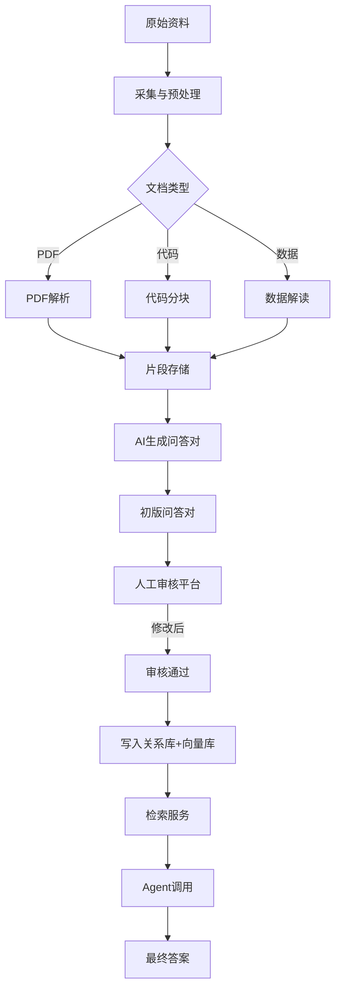

# 半导体智能知识库系统：项目需求与技术规格书
## 1. 项目背景与目标
### 1.1 背景
当前我们已有一个基于 ReAct 模式的 Agentic RAG 系统，能够回答 TCAD 仿真领域的专业问题。但该系统的知识库仍为原始的文档分块，缺乏精细化标注和结构化元数据，导致检索准确率受限、答案可追溯性不足。为提升系统能力，需构建一个**高质量的领域知识库**，以支撑 Agent 更精准、可信的回答。

### 1.2 目标
打造一个面向半导体领域（侧重 TCAD 仿真、器件物理、工艺技术）的智能知识库系统，实现：

+ **知识提炼**：从文献、教材、手册、代码、数据中自动或半自动生成问答对。
+ **结构化存储**：为每条知识附加丰富的元数据（主题、场景、置信度、来源等）。
+ **多源融合**：支持学术文献、官方手册、仿真代码等多种来源。
+ **人工审核**：建立多人协作的审核平台，确保知识质量。
+ **高效检索**：提供语义检索 + 元数据过滤的 API，供 Agent 调用。
+ **可追溯性**：答案可关联到原始文档片段，支持用户验证。

### 1.3 目标用户
+ **内部工程师**：需要精确的 TCAD 软件操作、参数设置、代码示例。
+ **科研人员**：需要前沿文献的结论、理论解释、引用来源。
+ **学生**：需要基础概念、原理讲解。
+ **客户支持**：需要产品使用指南、故障排查步骤。

---

## 2. 系统整体架构


系统由以下核心模块组成：

1. **数据采集与预处理模块**  
    - 从指定目录或外部源获取原始资料（PDF、代码、数据文件）。  
    - 解析文档，提取文本、表格、代码块，切分为有意义的片段（fragments）。  
    - 存储原始文件到对象存储（MinIO），元数据存入关系库（PostgreSQL）。
2. **知识提炼模块（AI 生成）**  
    - 对每个文档片段，调用大语言模型（LLM）生成若干问答对（QA pairs）。  
    - 同时生成初版主题标签、场景标签、置信度评分。  
    - 将生成的问答对存入关系库（状态为 `pending`），并关联到片段。
3. **人工审核平台**  
    - 提供 Web 界面，供领域专家查看、修改、确认问答对。  
    - 支持任务分配、审核记录、版本历史。  
    - 审核通过后，问答对状态变为 `reviewed`。
4. **存储层**  
    - **关系数据库（PostgreSQL）**：存储元数据（文档、片段、问答对、审核记录等）。  
    - **向量数据库（Weaviate）**：存储问答对的向量嵌入，支持语义检索 + 元数据过滤。  
    - **对象存储（MinIO）**：保存原始 PDF、代码文件等。
5. **检索服务 API**  
    - 提供 RESTful API，接收查询和过滤条件，返回最相关的问答对。  
    - 支持场景、主题、置信度、来源类型等过滤。  
    - 结果包含答案、置信度、来源信息，供 Agent 使用。
6. **Agent 集成**  
    - 现有 React Agent 调用检索 API，将问答对作为上下文，生成最终回答。  
    - 可选：Agent 根据意图识别动态调整检索参数。
7. **运维与协作**  
    - 使用 Docker Compose 部署所有服务。  
    - 通过 ZeroTier 或 Tailscale 实现团队内网访问。  
    - 定期备份数据。

---

## 3. 数据流详解


**关键节点说明**：

+ **片段存储**：每个片段关联原始文档，保留文本/代码及元数据（页码、位置等）。
+ **AI 生成**：使用预定义提示词模板，调用 LLM API（如 GPT-4、DeepSeek）生成问答对。生成结果包含 `question`、`answer`、`topics`、`scenes`、`initial_confidence`。
+ **人工审核**：审核员可修改内容、调整标签、修正置信度，并填写审核备注。审核后问答对状态更新为 `reviewed`，记录审核人和时间。
+ **向量化**：审核通过后，将 `question` 和 `answer` 拼接，用嵌入模型（如 `BAAI/bge-large-zh`）生成向量，存入 Weaviate，同时存储元数据（topic、scene、confidence 等）以便过滤。
+ **检索 API**：根据用户查询，先向量检索，再结合元数据过滤，返回 Top-K 问答对。

---

## 4. 技术选型
| 组件 | 技术 | 说明 |
| --- | --- | --- |
| 后端框架 | FastAPI | 高性能异步 API，自动文档 |
| 关系数据库 | PostgreSQL 15 | 存储结构化元数据，支持 JSONB |
| 向量数据库 | Weaviate | 开源，支持元数据过滤，易部署 |
| 对象存储 | MinIO | 兼容 S3，轻量自托管 |
| 任务队列 | Celery + Redis | 处理耗时任务（PDF 解析、AI 生成） |
| 嵌入模型 | BAAI/bge-large-zh-v1.5 | 中英文通用，可本地部署 |
| LLM API | 统一封装（OpenAI/DeepSeek/国产） | 根据成本和质量选择 |
| 审核前端 | Vue3 + Element Plus | 现代化界面，与后端分离 |
| 部署 | Docker Compose | 一键启动所有服务 |
| 团队协作 | ZeroTier / Tailscale | 虚拟组网，安全访问 |


---

## 5. 数据库设计核心表
### 5.1 `documents` – 原始文档
| 字段 | 类型 | 说明 |
| --- | --- | --- |
| id | UUID | 主键 |
| title | TEXT | 标题 |
| type | VARCHAR | paper/conference/book/manual/code/data |
| source_path | TEXT | MinIO 中的路径 |
| authors | JSONB | 作者列表 |
| year | INT | 出版年份 |
| doi | VARCHAR | DOI |
| ... | ... | 其他元数据 |


### 5.2 `fragments` – 文档片段
| 字段 | 类型 | 说明 |
| --- | --- | --- |
| id | UUID | 主键 |
| doc_id | UUID | 外键，关联 documents |
| fragment_type | VARCHAR | text/code/table/figure |
| page_start, page_end | INT | 页码范围 |
| content | TEXT | 片段原始内容 |
| meta | JSONB | 额外信息（如代码注释） |


### 5.3 `qa_pairs` – 问答对
| 字段 | 类型 | 说明 |
| --- | --- | --- |
| id | UUID | 主键 |
| question | TEXT | 问题 |
| answer | TEXT | 答案 |
| topics | TEXT[] | 主题标签（从预定义词表选取） |
| scenes | TEXT[] | 适用场景（engineer/researcher/student/support） |
| confidence | NUMERIC | 置信度（0.5-1.0） |
| source_type | VARCHAR | 来源类型（冗余，便于过滤） |
| doc_id | UUID | 关联的文档（可选） |
| status | VARCHAR | pending / reviewed / deprecated |
| reviewer | VARCHAR | 审核人 |
| reviewed_at | TIMESTAMP | 审核时间 |
| review_notes | TEXT | 审核备注 |
| version | INT | 版本号（用于修改追溯） |


### 5.4 `qa_fragment_link` – 问答对与片段的关联
| 字段 | 类型 | 说明 |
| --- | --- | --- |
| qa_id | UUID | 问答对 ID |
| fragment_id | UUID | 片段 ID |


### 5.5 `review_history` – 审核修改历史
记录每次修改的字段、旧值、新值、修改人、时间。

---

## 6. API 接口设计
### 6.1 内部管理接口（供审核平台）
| 方法 | 路径 | 说明 |
| --- | --- | --- |
| GET | `/api/qa/pending?limit=20` | 获取待审问答对列表 |
| GET | `/api/qa/{id}` | 获取问答对详情，含关联片段 |
| PUT | `/api/qa/{id}` | 更新问答对（审核通过） |
| GET | `/api/qa/stats` | 统计信息（待审数、已审数） |


### 6.2 检索接口（供 Agent 调用）
| 方法 | 路径 | 说明 |
| --- | --- | --- |
| POST | `/api/search` | 语义检索 |


```json
{
  "query": "GAA 量子限制设置",
  "scenes": ["engineer"],
  "topics": ["半导体器件", "TCAD仿真"],
  "min_confidence": 0.9,
  "source_types": ["manual"],
  "limit": 5
}
```

返回示例：

```json
[
  {
    "question": "GAA器件的量子限制效应在Sentaurus中如何设置？",
    "answer": "在models语句中添加qm参数，示例：models { qm }",
    "confidence": 0.95,
    "source": "Sentaurus Device User Guide, 2022",
    "fragment_ids": ["..."]
  }
]
```

### 6.3 文档管理接口
| 方法 | 路径 | 说明 |
| --- | --- | --- |
| POST | `/api/documents/upload` | 上传原始文件（PDF/代码） |
| GET | `/api/documents` | 列出已入库文档 |
| DELETE | `/api/documents/{id}` | 删除文档及关联数据 |


---

## 7. 审核平台功能需求
### 7.1 用户角色
+ **管理员**：分配任务、查看统计、管理用户。
+ **审核员**：领取任务、审核问答对。
+ **观察员**：只读查看。

### 7.2 主要功能
+ **任务分配**：管理员可将待审问答对批量分配给特定审核员，或采用“抢单”模式。
+ **审核界面**：
    - 展示问题、答案（可编辑）。
    - 展示关联的片段原文，支持展开/折叠。
    - 主题标签多选框（预定义列表）。
    - 场景标签多选框。
    - 置信度滑块（0.5-1.0）。
    - 审核备注文本框。
    - 提交按钮（状态变为 reviewed）。
+ **历史记录**：查看问答对的修改历史。
+ **统计仪表盘**：每个审核员的完成数量、平均审核时间。

### 7.3 技术实现
+ 前端：Vue 3 + Element Plus，与后端 API 交互。
+ 后端：FastAPI 提供 API，JWT 认证。
+ 部署：Docker 容器化。

---

## 8. 开发阶段与分工建议
### 阶段一：基础设施搭建（2天）
+ 部署 Docker 环境，编写 `docker-compose.yml`。
+ 启动 PostgreSQL、MinIO、Weaviate。
+ 创建数据库表结构、初始化 Weaviate Schema。
+ 配置 ZeroTier 虚拟组网。

**负责人**：后端工程师

### 阶段二：数据处理模块（5天）
+ 编写文档采集脚本（从本地目录读取）。
+ 实现 PDF 解析（使用 `pdfplumber`），生成 fragments。
+ 实现代码文件解析，分模块生成 fragments。
+ 将 fragments 存入数据库，原始文件上传 MinIO。

**负责人**：数据工程师 + 后端工程师

### 阶段三：AI 生成模块（5天）
+ 设计提示词模板（区分论文、手册、代码等）。
+ 封装 LLM API 调用，异步处理（Celery）。
+ 将生成的问答对写入 `qa_pairs` 表（状态 pending）。
+ 实现失败重试、限流机制。

**负责人**：后端工程师（熟悉 LLM API）

### 阶段四：审核平台（8天）
+ 后端 API：获取待审列表、更新问答对、历史记录。
+ 前端开发：登录、任务列表、审核详情页面。
+ 权限控制（简单角色）。
+ 部署前端（Nginx）。

**负责人**：前端工程师 + 后端工程师

### 阶段五：检索服务（3天）
+ 实现向量化逻辑：审核通过后自动触发，将问答对存入 Weaviate。
+ 编写检索 API：向量搜索 + 元数据过滤。
+ 集成重排序（可选）。
+ 编写 API 文档。

**负责人**：后端工程师

### 阶段六：Agent 集成（2天）
+ 修改现有 React Agent，将原有 RAG 替换为调用检索 API。
+ 增加意图识别，动态调整检索参数。
+ 测试端到端效果。

**负责人**：Agent 负责人

### 阶段七：测试与上线（3天）
+ 单元测试（各模块）。
+ 集成测试（端到端流程）。
+ 压力测试（检索 API 并发）。
+ 编写用户手册。

**所有人**

---

## 9. 质量保证措施
+ **人工审核**：每条问答对至少经过一名领域专家审核。
+ **抽样复审**：随机抽取 5% 已审条目由另一专家复核，不一致率超过 5% 则返工。
+ **版本控制**：修改问答对时不覆盖原记录，而是增加版本号，保留历史。
+ **置信度评分**：严格按标准执行（1.0 官方手册，0.95 顶刊，0.9 普通期刊等）。
+ **监控**：记录检索命中率、用户反馈（点赞/点踩），用于迭代优化。

---

## 10. 部署与协作
### 10.1 部署模式
+ **中心机**：选择一台配置较好的电脑（4核8GB以上）作为服务器，运行所有 Docker 服务。
+ **虚拟组网**：所有团队成员通过 ZeroTier 加入同一网络，通过虚拟 IP 访问中心机服务。
+ **代码管理**：所有代码托管在 GitHub 私有仓库，团队成员协作开发。

### 10.2 备份策略
+ 每日凌晨导出 PostgreSQL 数据库到备份目录。
+ 每周将 MinIO 数据同步到云存储（如阿里云 OSS）。
+ 保留最近 30 天的备份。

---

## 11. 交付物
- [ ] 可运行的 Docker Compose 配置，一键启动所有服务。
- [ ] 后端代码（FastAPI + Celery）。
- [ ] 前端审核平台（Vue 3）。
- [ ] 数据库初始化脚本。
- [ ] API 文档（Swagger）。
- [ ] 部署手册。
- [ ] 用户操作手册（审核员、管理员）。

---

## 12. 项目时间线
| 阶段 | 工期 | 开始日期 | 结束日期 |
| --- | --- | --- | --- |
| 基础设施 | 2天 | Day 1 | Day 2 |
| 数据处理 | 5天 | Day 3 | Day 7 |
| AI 生成 | 5天 | Day 8 | Day 12 |
| 审核平台 | 8天 | Day 13 | Day 20 |
| 检索服务 | 3天 | Day 21 | Day 23 |
| Agent 集成 | 2天 | Day 24 | Day 25 |
| 测试上线 | 3天 | Day 26 | Day 28 |


**总计**：28 个工作日（约 6 周）。

---

## 13. 结语
本系统将为半导体领域的智能问答提供坚实的知识基础。通过精细化的知识提炼、严格的质量控制、灵活的检索接口，最终实现 Agent 回答的高准确性、高可信度。开发过程中，请务必关注知识质量，确保每个环节的严谨性。

如有疑问，请随时与项目负责人沟通。祝开发顺利！
